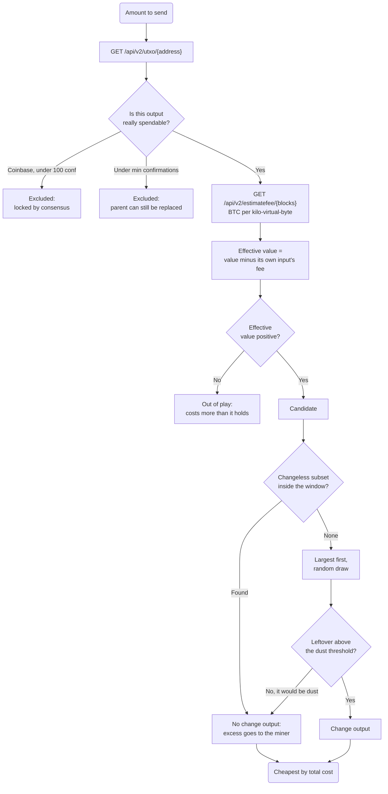

# How to Plan and Price a Bitcoin Spend with GetBlock's Blockbook Add-on

Bitcoin has no account balances. A wallet's balance is a fiction it computes by adding up unspent transaction outputs, and to send a payment it must choose which of those outputs to spend — a decision with no obvious right answer and real money riding on it. The choice is circular: the fee is a price per virtual byte, so it depends on the transaction's size, the size depends on how many inputs it has, and how many inputs it needs depends on the fee. Worse, some outputs only look spendable — a mining reward is locked by consensus for 100 blocks, and an output worth less than the fee to spend it is stranded value. Get any of this wrong and you produce a transaction that overpays by an order of magnitude, cannot be relayed, or cannot be mined at all.

In this guide, you will learn how to decide which unspent outputs to spend for a Bitcoin payment and what that payment will cost, using GetBlock's Blockbook add-on — with no private keys, no funds of your own, and nothing signed or broadcast.

### What you'll build

A `planAt(spendable, { amount, satPerKvB, inputType, toType, changeType })` function that:

1. Converts every output to its **effective value** — its worth minus the fee for its own input — which removes the circularity between fee and input count.
2. Drops outputs that cost more to spend than they hold, and reports how much value that strands.
3. Searches for a **changeless** combination that lands just above the target, so the transaction needs no change output at all.
4. Falls back to largest-first and random-draw selection when no changeless combination exists.
5. Prices each candidate plan, dropping a change output that would be dust and handing the leftover to the miner instead.
6. Ranks the plans by **total cost** — the fee plus what the change it leaves behind will cost to spend one day.

### How it works



The window in that decision is the **cost of change**: what a change output costs to create now, plus what it will cost to spend later. Overshooting the target by less than that is cheaper than taking the change — which is why a changeless plan deliberately overpays the miner a little.

## Prerequisites

- **Node.js 20.6 or later** — for the built-in `fetch` and `--env-file`, so there is nothing to install.
- A [**GetBlock account**](https://account.getblock.io).
- A **Bitcoin endpoint with the Blockbook add-on enabled (REST).** Blockbook keeps the address-indexed view of the chain that a plain Bitcoin node does not.
- **An address to plan against.** No wallet or funds needed: the guide points at a busy public address whose UTXO set is fragmented and dust-heavy, which is exactly what makes coin selection worth watching.
- Basic JavaScript knowledge.


Everything here is a `GET` request. Nothing in this guide needs a private key, and nothing it produces can move coins — turning a plan into a transaction means building a PSBT and signing it, which this program never does.


## Project Setup


### Get the REST endpoint

In the [GetBlock dashboard](https://account.getblock.io), create a Bitcoin mainnet endpoint with the **Blockbook** add-on. The REST base URL looks like this:

```bash
https://go.getblock.io/<YOUR_ACCESS_TOKEN>
```

Your access token is in that URL, so treat it like a password.



### Scaffold the project

```bash
mkdir blockbook-utxo-planner
cd blockbook-utxo-planner
npm init --yes
npm pkg set type=module
```



### Add your configuration

Create a `.env` file:


```bash
BLOCKBOOK_URL=https://go.getblock.io/<YOUR_ACCESS_TOKEN>

# A busy public address with a fragmented, dust-heavy UTXO set.
# In production this is an address your wallet controls.
SPEND_FROM=bc1q3zcdunpmqgn8enyxa3smu7fwrfvya35dz3uvjy

# Where the payment would go. Only its script type affects the plan.
SEND_TO=bc1qwzrryqr3ja8w7hnja2spmkgfdcgvqwp5swz4af4ngsjecfz0w0pqud7k38

# Confirmations an output needs before this planner will spend it.
MIN_CONFIRMATIONS=1
```




### See what the endpoints actually return

Three endpoints supply every fact the planner needs. Try them before building anything.

**The unspent outputs:**

```bash
curl -s "$BLOCKBOOK_URL/api/v2/utxo/bc1q3zcdunpmqgn8enyxa3smu7fwrfvya35dz3uvjy"
```

```json
[
  { "txid": "8a53380738c696c08deaa982624037566fb96306872e572247468641c8c0108b",
    "vout": 0, "value": "6991", "height": 962905, "confirmations": 1 },
  { "txid": "09afbcbaa150c1e62995698fa6cf411cc8e7dfc166615f93f4ed39b2285f269f",
    "vout": 0, "value": "8901", "confirmations": 0 }
]
```

| Parameter | Type | Description |
| --- | --- | --- |
| `address` | path | Address or xpub whose unspent outputs you want. |
| `confirmed` | query | `true` returns only confirmed outputs. The planner leaves it off deliberately — it wants to *count* the unconfirmed ones and say so, rather than have them silently disappear. |

**The fee estimate:**

```bash
curl -s "$BLOCKBOOK_URL/api/v2/estimatefee/6"
```

```json
{ "result": "0.00000490" }
```

| Parameter | Type | Description |
| --- | --- | --- |
| `blocks` | path | Confirmation target, 1–1008. Outside that range the node returns a bare `Internal server error` rather than a clean rejection. |


**That number is BTC per kilo-virtual-byte, not sat/vB.** `"0.00000490"` is 490 sat/kvB, which is **0.49 sat/vB**. This is the conversion that quietly goes wrong by a factor of a thousand, and a planner that gets it wrong either overpays enormously or builds a transaction no miner will include.


**What a real block charged**, which is worth comparing against the estimate:

```bash
curl -s "$BLOCKBOOK_URL/api/v2/feestats/962901"
```

```json
{ "txCount": 4157, "totalFeesSat": "2134319", "averageFeePerKb": 2141,
  "decilesFeePerKb": [0, 106, 151, 407, 1000, 1000, 1050, 1222, 2017, 3000, 1827840] }
```

The estimator predicts; `feestats` reports. `averageFeePerKb` is already in **satoshis** per kvB, unlike `estimatefee` — the two endpoints disagree about units, so convert each on its own terms.

The deciles are the more honest picture. In this block the mean was 2.14 sat/vB, but the median transaction paid 1.00 and the cheapest decile paid nothing at all, while the dearest paid 1,827 sat/vB. A single average hides a spread that wide, which is why the estimator's answer for one confirmation target is a policy choice and not a fact.



### Handle satoshis, and size a transaction

Create `plan.js`. Start with the arithmetic and the sizing, because a planner that cannot size a transaction cannot price one.


```js
const args = process.argv.slice(2);

// Split the arguments once: `--name value` pairs into a map, everything else
// into positionals. Scanning for each flag separately is how a value that looks
// like a flag ends up being read as one.
const flags = new Map();
const positional = [];
for (let i = 0; i < args.length; i++) {
  if (args[i].startsWith('--')) flags.set(args[i].slice(2), args[++i]);
  else positional.push(args[i]);
}
const flag = (name) => flags.get(name);

const baseUrl = (process.env.BLOCKBOOK_URL ?? '').replace(/\/+$/, '');
const amountArg = positional[0];
const from = flag('from') ?? process.env.SPEND_FROM;
const to = flag('to') ?? process.env.SEND_TO;
const minConf = Number(flag('min-conf') ?? process.env.MIN_CONFIRMATIONS ?? 1);
const feerateOverride = flag('feerate') === undefined ? undefined : Number(flag('feerate'));
const primaryTarget = Number(flag('target') ?? 6);

/** Parse a decimal BTC string ("0.0015") into satoshis, without touching a float. */
function toSats(btc) {
  const match = String(btc).trim().match(/^(\d*)(?:\.(\d{0,8})\d*)?$/);
  if (!match) throw new Error(`not a BTC amount: ${btc}`);
  const [, whole = '0', fraction = ''] = match;
  return BigInt((whole || '0') + fraction.padEnd(8, '0'));
}

/** Format satoshis as BTC, right-padded so columns line up. */
function btc(sats) {
  const negative = sats < 0n;
  const digits = String(negative ? -sats : sats).padStart(9, '0');
  return `${negative ? '-' : ''}${digits.slice(0, -8)}.${digits.slice(-8)}`;
}

/** Multiply a vsize by a feerate given in sat/kvB, rounding the fee up. */
function feeFor(vsize, satPerKvB) {
  return (BigInt(Math.ceil(vsize)) * satPerKvB + 999n) / 1000n;
}

// The standard vsize contributions per script type. An input's cost includes its
// witness, discounted by the segwit factor of four -- which is the whole reason a
// native segwit input is cheaper to spend than a legacy one.
const SCRIPTS = {
  p2pkh: { input: 148, output: 34, segwit: false },
  'p2sh-p2wpkh': { input: 91, output: 32, segwit: true },
  p2wpkh: { input: 68, output: 31, segwit: true },
  p2wsh: { input: 105, output: 43, segwit: true },
  p2tr: { input: 58, output: 43, segwit: true },
};

/**
 * Work out a script type from the address itself. The prefix names the encoding
 * and the length separates the two bech32 witness sizes.
 */
function scriptTypeOf(address) {
  const a = address.trim();
  const bech32 = a.match(/^(bc1|tb1|bcrt1)(.*)$/i);
  if (bech32) {
    const data = bech32[2];
    if (/^p/i.test(data)) return 'p2tr';
    return data.length > 45 ? 'p2wsh' : 'p2wpkh';
  }
  if (/^[mn2]/.test(a)) return a.startsWith('2') ? 'p2sh-p2wpkh' : 'p2pkh';
  if (a.startsWith('3')) return 'p2sh-p2wpkh';
  if (a.startsWith('1')) return 'p2pkh';
  throw new Error(`cannot tell the script type of ${a}`);
}

/**
 * Size a transaction with `inputs` inputs of one type and the given outputs.
 * Overhead is version, both varint counts and locktime; a segwit transaction
 * adds a marker and a flag byte, which the witness discount turns into half a
 * virtual byte.
 */
function vsizeOf(inputs, inputType, outputTypes) {
  const overhead = 10 + (SCRIPTS[inputType].segwit ? 0.5 : 0);
  const inputCost = inputs * SCRIPTS[inputType].input;
  const outputCost = outputTypes.reduce((total, type) => total + SCRIPTS[type].output, 0);
  return Math.ceil(overhead + inputCost + outputCost);
}

/**
 * The smallest change output worth creating. Below this, an output costs more to
 * spend later than it is worth, and the network will not relay it: Bitcoin Core
 * prices dust at the dust relay fee -- 3 sat/vB by default -- over the output's
 * own size plus the size of the input that would one day spend it.
 */
function dustThreshold(type) {
  return BigInt(Math.ceil((SCRIPTS[type].output + SCRIPTS[type].input) * 3));
}
```



Every amount is a `BigInt` count of satoshis, from the moment it is parsed to the moment it is printed. A wallet that puts a satoshi value through a float is a wallet that eventually sends the wrong amount — `0.1 + 0.2` is not `0.3`, and here that is somebody's money.




### Talk to Blockbook

Two helpers: one that fetches and one that turns the fee estimates into satoshis.


```js
async function blockbook(path) {
  const response = await fetch(`${baseUrl}${path}`);
  const text = await response.text();

  let body;
  try {
    body = JSON.parse(text);
  } catch {
    // A REST endpoint answering with HTML is Blockbook's explorer page, which
    // means the path was wrong -- not that the chain said no.
    throw new Error(`${path} did not return JSON (HTTP ${response.status})`);
  }
  if (body?.error) throw new Error(`${path}: ${body.error}`);
  return body;
}

/**
 * Fee estimates for a set of confirmation targets, as sat/kvB.
 *
 * The node only estimates over a bounded horizon; outside it, the request fails
 * rather than returning a best guess, so a missing tier is skipped instead of
 * being allowed to abort the run.
 */
async function feeEstimates(targets) {
  const settled = await Promise.allSettled(
    targets.map(async (blocks) => ({
      blocks,
      satPerKvB: toSats((await blockbook(`/api/v2/estimatefee/${blocks}`)).result),
    })),
  );
  return settled
    .filter((entry) => entry.status === 'fulfilled' && entry.value.satPerKvB > 0n)
    .map((entry) => entry.value);
}
```


Reusing `toSats` on the estimator's reply is the whole unit conversion: a BTC decimal string becomes an integer count of satoshis per kilo-virtual-byte, and `feeFor` divides by a thousand at the point of use.



### Select the coins

This is the heart of it. Three strategies, all working in effective value.


```js
/**
 * Search for a combination that needs no change output at all, within a window
 * above the target. This is the selection every wallet wants and few find: no
 * change output means a smaller transaction, a smaller fee, no leftover dust to
 * spend later, and nothing linking this payment to the next one.
 *
 * The window is the cost of change -- what a change output would cost to create
 * now plus what it would cost to spend later. Overshooting the target by less
 * than that is cheaper than taking the change, so the excess goes to the miner.
 *
 * Depth-first with two prunes (overshoot, and cannot-reach from the remaining
 * total), capped by a try budget because the search space is exponential.
 */
function selectChangeless(candidates, target, window, maxTries = 100_000) {
  const n = candidates.length;

  // Suffix sums: the most that can still be added from position i onwards.
  const remaining = new Array(n + 1).fill(0n);
  for (let i = n - 1; i >= 0; i--) remaining[i] = remaining[i + 1] + candidates[i].effective;

  let best = null;
  let tries = 0;
  const chosen = [];

  function search(index, total) {
    if (tries++ > maxTries) return;

    if (total > target + window) return; // Overshot the window.
    if (total >= target) {
      const excess = total - target;
      if (!best || excess < best.excess) best = { excess, indexes: [...chosen] };
      return; // Adding more can only overshoot further.
    }
    if (index >= n) return;
    if (total + remaining[index] < target) return; // Cannot reach the target from here.

    chosen.push(index);
    search(index + 1, total + candidates[index].effective);
    chosen.pop();

    search(index + 1, total);
  }

  search(0, 0n);
  return best;
}

/** Take the largest outputs until the target is covered. */
function selectLargestFirst(candidates, target) {
  const indexes = [];
  let total = 0n;
  for (let i = 0; i < candidates.length && total < target; i++) {
    indexes.push(i);
    total += candidates[i].effective;
  }
  return total >= target ? { indexes, total } : null;
}

/**
 * Draw outputs at random until the target is covered.
 *
 * Not a worse version of largest-first: it fragments the wallet less. Always
 * spending the largest output leaves nothing but small ones behind, so the fee
 * saved today is paid back with interest on the day the wallet has to spend
 * forty dust outputs at once. Bitcoin Core falls back to this for the same
 * reason.
 */
function selectRandom(candidates, target, random = Math.random) {
  const order = candidates.map((_, i) => i);
  for (let i = order.length - 1; i > 0; i--) {
    const j = Math.floor(random() * (i + 1));
    [order[i], order[j]] = [order[j], order[i]];
  }

  const indexes = [];
  let total = 0n;
  for (const i of order) {
    if (total >= target) break;
    indexes.push(i);
    total += candidates[i].effective;
  }
  return total >= target ? { indexes, total } : null;
}
```




### Price each plan, and rank them

Selection picks the inputs; costing decides what happens to the leftover.


```js
/**
 * Turn a set of chosen outputs into a costed plan, deciding whether the leftover
 * is worth keeping as change or should be handed to the miner as fee.
 *
 * `totalCost` is what makes two plans comparable. Comparing fees alone is
 * misleading: a changeless plan's fee has swallowed the leftover, so it looks
 * expensive next to a plan that keeps its change -- but that change still has to
 * be spent one day, and paying for its input then is a real cost deferred, not
 * avoided. Charging each plan for the change it leaves behind puts both on the
 * same footing.
 */
function cost(indexes, candidates, { amount, satPerKvB, inputType, toType, changeType }) {
  const inputs = indexes.map((i) => candidates[i]);
  const gross = inputs.reduce((total, utxo) => total + utxo.value, 0n);

  const withChange = vsizeOf(inputs.length, inputType, [toType, changeType]);
  const withoutChange = vsizeOf(inputs.length, inputType, [toType]);
  const change = gross - amount - feeFor(withChange, satPerKvB);

  // A change output below the dust threshold cannot be relayed and would cost
  // more to spend than it holds. Drop it, and the whole leftover becomes fee.
  if (change < dustThreshold(changeType)) {
    const fee = gross - amount;
    return {
      inputs,
      gross,
      change: 0n,
      vsize: withoutChange,
      fee,
      overpaid: fee - feeFor(withoutChange, satPerKvB),
      totalCost: fee,
    };
  }

  const fee = feeFor(withChange, satPerKvB);
  return {
    inputs,
    gross,
    change,
    vsize: withChange,
    fee,
    overpaid: 0n,
    totalCost: fee + feeFor(SCRIPTS[changeType].input, satPerKvB),
  };
}

/** Run every strategy at one feerate and return the costed plans. */
function planAt(spendable, { amount, satPerKvB, inputType, toType, changeType }) {
  const inputFee = feeFor(SCRIPTS[inputType].input, satPerKvB);

  // An output whose value does not cover the fee for its own input is not worth
  // spending: including it makes the transaction more expensive, not less short.
  const candidates = spendable
    .map((utxo) => ({ ...utxo, effective: utxo.value - inputFee }))
    .filter((utxo) => utxo.effective > 0n)
    .sort((a, b) => (b.effective > a.effective ? 1 : b.effective < a.effective ? -1 : 0));

  const uneconomic = spendable.length - candidates.length;
  const context = { amount, satPerKvB, inputType, toType, changeType };

  // Two targets, in effective-value terms. Neither moves as inputs are added.
  const targetWithChange = amount + feeFor(vsizeOf(0, inputType, [toType, changeType]), satPerKvB);
  const targetChangeless = amount + feeFor(vsizeOf(0, inputType, [toType]), satPerKvB);

  // The cost of change: creating one now, and spending it some day.
  const window =
    feeFor(SCRIPTS[changeType].output, satPerKvB) + feeFor(SCRIPTS[changeType].input, satPerKvB);

  const available = candidates.reduce((total, utxo) => total + utxo.effective, 0n);
  if (available < targetChangeless) {
    return { candidates, uneconomic, available, plans: [], short: targetWithChange - available };
  }

  const plans = [];

  // The changeless search often finds nothing, and that is not a failure of the
  // search -- a wallet holding four large outputs simply has no subset that lands
  // within a hundred satoshis of the target. Reporting the miss is the honest
  // result, and it is the reason a wallet needs the fallbacks below at all.
  const changeless = selectChangeless(candidates, targetChangeless, window);
  if (changeless) {
    plans.push({ strategy: 'changeless search', ...cost(changeless.indexes, candidates, context) });
  } else {
    plans.push({ strategy: 'changeless search', missing: 'no combination within the window' });
  }

  const largest = selectLargestFirst(candidates, targetWithChange);
  if (largest) {
    plans.push({ strategy: 'largest first', ...cost(largest.indexes, candidates, context) });
  }

  const random = selectRandom(candidates, targetWithChange);
  if (random) {
    plans.push({ strategy: 'random draw', ...cost(random.indexes, candidates, context) });
  }

  return { candidates, uneconomic, available, plans, short: 0n };
}
```


Notice what the two targets do. `targetWithChange` and `targetChangeless` are computed with **zero inputs** — they cover only the overhead and the outputs. Because each candidate has already paid for its own input inside its effective value, the target never moves as inputs are added. That is what breaks the circularity, and it is why the leftover at the end is exactly the change.



### Classify the outputs and report

The last piece is the part most easily skipped: two kinds of output look spendable in a balance and are not.


```js
const pad = (value, width) => String(value).padStart(width);
const satPerVb = (satPerKvB) => (Number(satPerKvB) / 1000).toFixed(2);

/**
 * The best plan is the one that costs the wallet least overall, and the
 * tie-break is fewer inputs: a plan that consumes less of the wallet leaves more
 * of it usable, and a smaller transaction reveals less about what else is there.
 */
const bestOf = (plans) =>
  plans
    .filter((plan) => !plan.missing)
    .reduce((a, b) =>
      b.totalCost < a.totalCost || (b.totalCost === a.totalCost && b.inputs.length < a.inputs.length)
        ? b
        : a,
    );

const anyPlan = (plans) => plans.some((plan) => !plan.missing);

async function main() {
  const amount = toSats(amountArg);
  const inputType = scriptTypeOf(from);
  const toType = scriptTypeOf(to);
  const changeType = inputType; // Change comes home to the same kind of script.

  const [status, utxos] = await Promise.all([
    blockbook('/api/v2'),
    blockbook(`/api/v2/utxo/${from}`),
  ]);

  const height = status.blockbook.bestHeight;
  const ticker = status.blockbook.network;

  console.log(`Blockbook  ${status.blockbook.coin} at height ${height}`);
  if (!status.blockbook.inSync) {
    // A lagging index reports stale confirmation counts, which is how a planner
    // ends up spending an output that has already been spent.
    console.log('  WARNING: the index is not in sync with its node');
  }

  const spendable = [];
  let immature = 0;
  let tooNew = 0;
  let held = 0n;

  for (const utxo of utxos) {
    const value = BigInt(utxo.value);
    const confirmations = utxo.confirmations ?? 0;
    held += value;

    // A coinbase output cannot be spent for 100 blocks. It is not a policy
    // choice: a consensus rule rejects the transaction, so this exclusion is
    // the difference between a valid plan and an invalid one.
    if (utxo.coinbase && confirmations < 100) {
      immature++;
      continue;
    }
    if (confirmations < minConf) {
      tooNew++;
      continue;
    }
    spendable.push({ txid: utxo.txid, vout: utxo.vout, value, confirmations });
  }

  const spendableTotal = spendable.reduce((total, utxo) => total + utxo.value, 0n);
  // ... print the wallet, the fee tiers, the strategy table and the chosen plan
}

main().catch((error) => {
  console.error(`\nFailed: ${error.message}`);
  process.exit(1);
});
```


The full reporting code — the fee-tier table, the strategy comparison and the sensitivity table — is in the [project repo](https://github.com/GetBlock-io/guides).



### Run it

```bash
node --env-file=.env plan.js 0.0015
```

```
Blockbook  Bitcoin at height 962906

Spending from  bc1q3zcdunpmqgn8enyxa3smu7fwrfvya35dz3uvjy
  script type  p2wpkh
  270 unspent output(s), 0.09544355 BTC held
  148 spendable, 0.02297506 BTC
      122 below 1 confirmation(s)

Paying         0.00150000 BTC
  to           bc1qwzrryqr3ja8w7hnja2spmkgfdcgvqwp5swz4af4ngsjecfz0w0pqud7k38
  script type  p2wsh

Fee estimates  /api/v2/estimatefee
  1 block(s)     1.11 sat/vB
  3 block(s)     1.11 sat/vB
  6 block(s)     0.49 sat/vB
  144 block(s)   0.10 sat/vB
  block 962901 really paid 2.14 sat/vB on average, 1.00 median, over 4157 transactions

Selection at 0.49 sat/vB, targeting 6 block(s)

  strategy            inputs   vsize   fee sats     change BTC   total sats
  changeless search       12     870       439           none         439
  largest first           10     765       375     0.00013625         409
  random draw             10     765       375     0.00003833         409

  Best: largest first
    10 input(s) worth 0.00164000 BTC, 765 vB
    0.00150000 to the recipient
    0.00013625 back as change
    0.00000375 to fees
```

Two things are already visible. The address holds 0.0954 BTC but only 0.0230 BTC of it is spendable — 122 of its 270 outputs are still in the mempool. And a 0.0015 BTC payment needs **ten inputs**, because this wallet has no large outputs to spend.

At this feerate change is nearly free, so keeping it wins. Force a busy mempool and the answer changes:

```bash
node --env-file=.env plan.js 0.0015 --feerate 150
```

```
Selection at 150.00 sat/vB
  12 output(s) cost more to spend than they hold at this feerate, and are out of play

  strategy            inputs   vsize   fee sats     change BTC   total sats
  changeless search       26    1822    276400           none      276400
  largest first           27    1921    288150     0.00004650      298350
  random draw             27    1921    288150     0.00004650      298350

  Best: changeless search
    26 input(s) worth 0.00426400 BTC, 1822 vB
    0.00150000 to the recipient
    0.00276400 to fees

    No change output: the 3100 sats over the target go to the miner rather than
    into an output that would cost more to spend later than it is worth. The
    transaction is smaller, and nothing links this payment to the next one.
```

The changeless plan now wins, twelve outputs have dropped out of play entirely, and the fee to send 0.0015 BTC is 0.00276 BTC — **nearly twice the payment**. That is the true cost of a fragmented wallet, and it only becomes visible when fees rise.

Push further and the wallet stops working altogether:

```bash
node --env-file=.env plan.js 0.0015 --feerate 300
```

```
Selection at 300.00 sat/vB
  148 output(s) cost more to spend than they hold at this feerate, and are out of play
  Every output is uneconomic at this feerate: 0.02297506 BTC is held here,
  and none of it can move until fees fall.
```

Every output is worth less than the 20,400 sats its own input would cost. The balance is real, the keys work, and not one satoshi can move.



### Watch the coinbase rule bite

Point the planner at a mining address to see the other exclusion. This one comes from a block's coinbase transaction:

```bash
node --env-file=.env plan.js 3.0 \
  --from bc1qwzrryqr3ja8w7hnja2spmkgfdcgvqwp5swz4af4ngsjecfz0w0pqud7k38 \
  --to bc1q3zcdunpmqgn8enyxa3smu7fwrfvya35dz3uvjy
```

```
Spending from  bc1qwzrryqr3ja8w7hnja2spmkgfdcgvqwp5swz4af4ngsjecfz0w0pqud7k38
  script type  p2wsh
  77 unspent output(s), 226.07914652 BTC held
  49 spendable, 138.10084591 BTC
       28 immature coinbase (locked for 100 blocks)

Selection at 0.49 sat/vB, targeting 6 block(s)

  strategy            inputs   vsize   fee sats     change BTC   total sats
  changeless search   no combination within the window
  largest first             1     190        94     0.16781558         146
  random draw               1     190        94     0.13517044         146
```

Of 226 BTC held, 88 BTC is unspendable — 28 recent mining rewards still inside their 100-block maturity window. Spending one is not merely unwise; consensus rejects the transaction.

The changeless search also reports a miss here, and that is the honest answer rather than a bug: a wallet holding a few very large outputs has no subset that lands within a hundred satoshis of the target. This is exactly why a real wallet needs fallback strategies.


Treat the vsize and fee in this particular example as indicative rather than exact. This address is P2WSH, and a P2WSH input's witness is a script that can be almost any size — the 105 vB in `SCRIPTS` is a reasonable stand-in for a small multisig, not a universal figure. The single-key types (P2PKH, P2SH-P2WPKH, P2WPKH, P2TR) are accurate.



## Understanding the response

A `/api/v2/utxo/{address}` entry describes one unspent output:

| Field | Type | What it tells you |
| --- | --- | --- |
| `txid` | string | The transaction that created this output. Half of the outpoint that identifies it. |
| `vout` | integer | Which output of that transaction. The other half of the outpoint. |
| `value` | string | The amount, in satoshis as a decimal string. Parse it with `BigInt`, never `Number`. |
| `height` | integer | The block that confirmed it. Absent while the output is unconfirmed. |
| `confirmations` | integer | How many blocks bury it. `0` means it is still in the mempool, and inherits its parent's replaceability. |
| `coinbase` | boolean | Present and `true` for a mining reward. Unspendable until 100 confirmations, by consensus. |

Fields are omitted rather than zeroed when they do not apply: an unconfirmed output has no `height`, and `coinbase` appears only on mining rewards. Treat every field as optional and default it, which is what `utxo.confirmations ?? 0` is doing.

And the two fee endpoints:

| Field | Type | What it tells you |
| --- | --- | --- |
| `result` | string | `estimatefee` — the feerate in **BTC per kilo-virtual-byte**. Multiply by 100,000,000 for sat/kvB, then divide by 1,000 for sat/vB. |
| `averageFeePerKb` | integer | `feestats` — the mean feerate a block actually paid, in **satoshis** per kvB. Different unit from `result` above. |
| `decilesFeePerKb` | array | Eleven feerates from cheapest to dearest transaction in that block, in sat/kvB. Index 5 is the median. |
| `txCount` | integer | Transactions in the block, which tells you how much the deciles are worth trusting. |

## Troubleshooting

| Symptom | Likely cause | Fix |
|---|---|---|
| `npm start` prints the usage message even though `.env` is filled in | `npm` keeps the arguments for itself, so the amount never reaches the script. | `npm start -- 0.0015` — the `--` passes the rest through. Or call `node --env-file=.env plan.js 0.0015` directly. |
| The response is HTML, not JSON | The path was wrong, so Blockbook served its explorer page instead of the API. | Check the path starts `/api/v2/`. A `200` with `<!doctype html>` is a routing mistake, not a chain error. |
| Fees are roughly a thousand times too high or too low | `estimatefee` returns BTC per **kilo**-virtual-byte, and it is easy to read as sat/vB or BTC/vB. | `"0.00000490"` is 490 sat/kvB, so 0.49 sat/vB. Convert once, in one place. |
| `estimatefee` returns `Internal server error` | The confirmation target is outside the node's horizon of 1–1008 blocks. | Ask for a target in range. The error is bare, so treat any failure as "no estimate for this tier" and carry on. |
| `Invalid address '...', checksum mismatch` | A typo in the address, or a network mismatch such as a testnet address on a mainnet endpoint. | Check the address, and check the endpoint is for the chain you meant. |
| The plan is rejected by the network as non-standard | A change output below the dust threshold. | Compare change against `(output size + input size) × 3` sat — the dust relay fee is 3 sat/vB by default — and drop the output if it falls short, letting the leftover become fee. |
| A plan is never mined | It included an immature coinbase output, or an unconfirmed one whose parent was replaced. | Exclude coinbase outputs under 100 confirmations, and require at least one confirmation for the rest. |
| The fee is larger than the payment | The wallet is fragmented, so the payment needs many inputs, and each input costs 68 vB. | This is a real result, not a bug. Consolidate when fees are low, so a payment does not need forty inputs when they are high. |
| Balance looks right but nothing can be spent | Every output is worth less than the fee for its own input at the current feerate. | Wait for cheaper fees. Value in outputs smaller than their own input cost is stranded, not lost. |
| Confirmation counts look stale | Blockbook's index has fallen behind its node. | Compare `blockbook.bestHeight` with `backend.blocks` in `/api/v2`. The `inSync` flag can read `true` while the index sits a block behind. |

## Where to take it

Three changes turn this into a wallet's selection layer.

**Plan across a whole wallet, not one address.** The same `/api/v2/utxo/` path accepts an xpub, ypub or zpub in place of an address and returns the unspent outputs across every derived address, so selection runs over the real wallet rather than one slice of it. Selection logic is unchanged; what changes is that each chosen input has to carry the derivation path its signer will need, so check which fields your endpoint returns for an xpub before relying on them.

**Mix script types honestly.** The sizing here assumes every input is the same type, which is true for one address and false for a real wallet. Carry a per-input vsize instead of a single `inputType`, and compute each input's effective value from its own cost — a Taproot input at 58 vB and a legacy input at 148 vB are worth genuinely different amounts of the same nominal value.

**Turn the plan into a PSBT.** The plan already names the outpoints, the amounts and the change; a PSBT is that plus the metadata a signer needs. Building one keeps the split this guide relies on — the process that chooses coins never has to hold a key.

Two limits worth knowing. The changeless search is capped at 100,000 attempts, so on a large UTXO set it may miss a combination that exists; Bitcoin Core's version also minimizes long-term waste rather than immediate excess, which matters when today's feerate is unusually far from normal. And every plan is a snapshot: an output can be spent by another process between the query and the broadcast, so a production wallet locks the outputs it has selected and re-checks before signing.

## Conclusion

You built a Bitcoin coin selector and fee planner in one dependency-free file, using Blockbook's UTXO and fee-estimate endpoints to answer the question a wallet must answer before it can sign: which outputs to spend, and at what cost. The ideas that made it work were switching to effective value so each input pays for its own fee and the target stops moving, excluding outputs that consensus or economics put out of reach, searching for a combination that needs no change at all, dropping change that would be dust, and comparing plans by total cost rather than by fee. None of it needed a private key.

### Resources

- [Blockbook add-on](https://docs.getblock.io/add-ons/blockbook) — which chains it serves, and what the index answers
- [Blockbook REST API reference](https://docs.getblock.io/api-reference/bitcoin-cash-bch/bitcoin-cash-blockbook-rest-api) — documented under Bitcoin Cash, but Blockbook serves every UTXO chain through one shared schema, so the paths and responses are the same on Bitcoin
- [Upstream Blockbook API reference](https://github.com/trezor/blockbook/blob/master/docs/api.md) — Trezor's own docs for the endpoints
- [Upstream Blockbook fee documentation](https://github.com/trezor/blockbook/blob/master/docs/fees.md) — how the fee endpoints derive their numbers
- [Bitcoin Core's coin selection](https://github.com/bitcoin/bitcoin/blob/master/src/wallet/coinselection.cpp) — branch-and-bound and the waste metric, in full
- [Create an endpoint and enable add-ons](https://account.getblock.io)
- [Project repo](https://github.com/GetBlock-io/guides)
