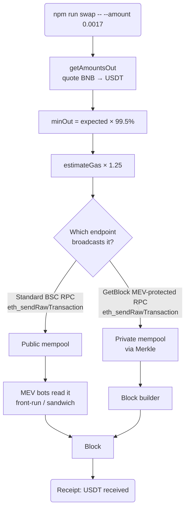

# How to Protect Your Transactions from MEV with GetBlock

Every transaction you send to a public blockchain waits in the mempool before it is mined, and while it waits, anyone can read it. Searchers run bots that scan that queue for trades worth exploiting — buying ahead of your swap to push the price up, selling into it afterwards, or wrapping it in a pair of their own trades so you fill at the worst price in the block. This is Maximal Extractable Value, and on a DEX swap it comes straight out of your output. The frustrating part is that nothing in your code is wrong: the vulnerability is simply that your transaction was visible while pending. Every one of those attacks depends on that visibility, and nothing else.

In this guide, you will learn how to protect your transactions from MEV on BNB Smart Chain by building a PancakeSwap swap CLI that routes through a GetBlock BSC endpoint with the **MEV Protection** add-on enabled.

### What you'll build

A `swap` command — `npm run swap -- --amount <BNB>` — built around a `main()` function that:

1. Quotes the BNB → USDT swap on PancakeSwap V2 with `getAmountsOut`.
2. Derives a minimum-received floor from your slippage tolerance.
3. Estimates gas and adds a safety buffer before signing.
4. Sends `swapExactETHForTokens` through your MEV-protected endpoint.
5. Waits for the receipt and reports the USDT actually received.

### How it works



The decision node is the entire integration. Both branches send the identical signed transaction with the identical RPC method — only the URL differs. On the protected branch the transaction never enters the public queue, so a searcher has nothing to read and nothing to attack.

## Prerequisites

- **Node.js 18+** — the project uses ES modules and top-level `async`.
- A [**GetBlock account**](https://account.getblock.io) — free to create.
- A [**BSC endpoint with MEV Protection**](https://docs.getblock.io/add-ons/mev-protection) — created in the dashboard, with the add-on enabled.
- **A funded BSC wallet** — roughly $2 of BNB is plenty. Use a throwaway key, never a wallet holding real funds.
- Basic JavaScript knowledge.

## Project Setup



### Create the project and install dependencies

```bash
mkdir mev-protected-swap && cd mev-protected-swap
npm init -y
npm pkg set type=module
npm install ethers dotenv
npm pkg set scripts.swap="node index.js"
```



### Create your MEV-protected endpoint

In your [GetBlock dashboard](https://account.getblock.io), create a **BNB Smart Chain** endpoint on **Mainnet**, then enable the **MEV Protection** add-on for it. Copy the JSON-RPC URL, which looks like:

```bash
https://go.getblock.io/<YOUR_ACCESS_TOKEN>
```

GetBlock routes transactions sent to this endpoint through a private mempool in partnership with **Merkle**, a trusted private builder. The transaction goes straight to the builder instead of being broadcast to the public queue.



### Configure your environment

Create a `.env` file with your key and endpoint:


```bash
PRIVATE_KEY=0x...
BSC_MEV_RPC=https://go.getblock.io/<YOUR_ACCESS_TOKEN>
```


Add it to `.gitignore` so the key never reaches your repository:

```bash
echo -e "node_modules/\n.env" > .gitignore
```



### Build the swap

Create `index.js`. The whole file is below; the comments mark the three decisions that matter.


```js
import { Contract, JsonRpcProvider, Wallet, formatUnits, parseEther } from "ethers";
import "dotenv/config";

const CHAIN_ID = 56; // BSC mainnet
const ROUTER = "0x10ED43C718714eb63d5aA57B78B54704E256024E"; // PancakeSwap V2
const WBNB = "0xbb4CdB9CBd36B01bD1cBaEBF2De08d9173bc095c";
const USDT = "0x55d398326f99059fF775485246999027B3197955"; // 18 decimals on BSC

const ROUTER_ABI = [
  "function getAmountsOut(uint256 amountIn, address[] path) view returns (uint256[] amounts)",
  "function swapExactETHForTokens(uint256 amountOutMin, address[] path, address to, uint256 deadline) payable returns (uint256[])",
];

const ERC20_ABI = ["function balanceOf(address) view returns (uint256)"];

function arg(name, fallback) {
  const i = process.argv.indexOf(`--${name}`);
  const value = i === -1 ? fallback : process.argv[i + 1];
  if (value === undefined) throw new Error(`Missing --${name}`);
  return value;
}

async function main() {
  for (const key of ["PRIVATE_KEY", "BSC_MEV_RPC"]) {
    if (!process.env[key]) throw new Error(`Missing ${key} - see .env.example`);
  }

  const amountIn = parseEther(arg("amount"));
  const slippage = Number(arg("slippage", "0.5"));

  // Every call and every transaction below goes through this one endpoint.
  // Because it has the MEV Protection add-on enabled, the swap is routed to a
  // private mempool instead of the public one - no bot sees it before it lands.
  const provider = new JsonRpcProvider(process.env.BSC_MEV_RPC, CHAIN_ID, {
    staticNetwork: true,
  });
  const wallet = new Wallet(process.env.PRIVATE_KEY, provider);
  const router = new Contract(ROUTER, ROUTER_ABI, wallet);
  const usdt = new Contract(USDT, ERC20_ABI, provider);

  // BNB is the native coin, so the swap needs no token approval. The router
  // wraps it to WBNB internally, which is why the path starts there.
  const path = [WBNB, USDT];

  // Quote first, so you know what you are agreeing to before you sign.
  const amounts = await router.getAmountsOut(amountIn, path);
  const expectedOut = amounts[amounts.length - 1];

  // The floor you are willing to accept. This is a separate defence from MEV
  // Protection: the add-on stops a sandwich being possible at all, while this
  // caps your loss if the price simply moves while the swap is in flight.
  const minOut = (expectedOut * BigInt(Math.round((100 - slippage) * 100))) / 10000n;

  console.log(`Swap ${arg("amount")} BNB -> USDT`);
  console.log(`  expected      ${formatUnits(expectedOut, 18)} USDT`);
  console.log(`  min received  ${formatUnits(minOut, 18)} USDT (${slippage}% slippage)`);
  console.log(`  wallet        ${wallet.address}`);

  const before = await usdt.balanceOf(wallet.address);
  const deadline = Math.floor(Date.now() / 1000) + 300; // 5 minutes

  console.log("\nSending swap through the MEV-protected endpoint...");

  const swapArgs = [minOut, path, wallet.address, deadline];

  // eth_estimateGas returns the *minimum* gas that succeeds against the state
  // it saw. Pool reserves move between the estimate and inclusion, and a
  // private mempool can mean a longer wait, so sending the bare estimate
  // reverts the moment the swap needs one gas more than it did a second ago.
  // A 25% buffer costs nothing - unused gas is refunded.
  const estimate = await router.swapExactETHForTokens.estimateGas(...swapArgs, {
    value: amountIn,
  });

  const tx = await router.swapExactETHForTokens(...swapArgs, {
    value: amountIn,
    gasLimit: (estimate * 125n) / 100n,
  });

  console.log(`  tx ${tx.hash}`);
  const receipt = await tx.wait();
  console.log(`  mined in block ${receipt.blockNumber}`);

  const after = await usdt.balanceOf(wallet.address);
  console.log(`  received ${formatUnits(after - before, 18)} USDT`);
  console.log(`\nhttps://bscscan.com/tx/${tx.hash}`);

  provider.destroy();
}

main().catch((error) => {
  console.error(`\n${error.shortMessage ?? error.message}`);
  process.exit(1);
});
```


Notice what is **not** in this file. There is no bundle format, no relay-specific RPC method, no extra signature, and no SDK. `swapExactETHForTokens` is called exactly as it would be against any BSC node, and ethers broadcasts it with a plain `eth_sendRawTransaction`. The protection comes from `BSC_MEV_RPC` pointing at an MEV-protected endpoint — that single line is the whole integration.



### Run the swap

`--amount` is required, so a bare command can never spend money you did not name. `--slippage` defaults to `0.5`.

```bash
npm run swap -- --amount 0.0017
```

At the time of writing, `0.0017` BNB is about $1. Expected output:

```bash
Swap 0.0017 BNB -> USDT
  expected      1.02178092834070772 USDT
  min received  1.016672023699004181 USDT (0.5% slippage)
  wallet        0xD1AF2dAc4e0a9d1F58B99E2f42Bc0320Ed74a7cd

Sending swap through the MEV-protected endpoint...
  tx 0xae41676f377227eb06ca63b3c004e24bad1e1561c3c743f32f90fa650e5f9eeb
  mined in block 115128238
  received 1.021778172305552024 USDT

https://bscscan.com/tx/0xae41676f377227eb06ca63b3c004e24bad1e1561c3c743f32f90fa650e5f9eeb
```

The swap filled at `1.021778` USDT against an expected `1.021781` — a gap of three millionths of a USDT, and comfortably above the `1.016672` floor. There was no sandwich to absorb, because there was never a pending transaction for a bot to find.



## Understanding the response

| Field | Type | What it tells you |
|---|---|---|
| `expected` | decimal string | The router's quote for your input at current reserves, before any price movement. |
| `min received` | decimal string | The floor your transaction enforces on-chain. The swap reverts rather than fill below this. |
| `wallet` | address | The account derived from `PRIVATE_KEY` that signs and receives. |
| `tx` | 32-byte hash | The transaction hash, computed at signing and valid to look up once mined. |
| `mined in block` | integer | The block that included the swap, from the transaction receipt. |
| `received` | decimal string | Your actual fill, measured as the USDT balance difference across the swap. Compare it to `expected` to see your real slippage. |

## Troubleshooting

| Symptom | Likely cause | Fix |
|---|---|---|
| Transaction reverts with `gasUsed` just below the gas limit | Ethers sent the bare `eth_estimateGas` result, which is the *minimum* gas that succeeds at estimation time. Pool state moved before inclusion and an inner call hit EIP-150's 63/64 limit. | Set an explicit `gasLimit` with headroom, as this guide does with `(estimate * 125n) / 100n`. Unused gas is refunded. |
| `PancakeRouter: INSUFFICIENT_OUTPUT_AMOUNT` | The price moved further than your slippage tolerance between the quote and inclusion. | Raise `--slippage`, or re-run when the pool is calmer. Do not raise it beyond what you would accept losing. |
| `PancakeRouter: EXPIRED` | The 5-minute deadline passed before the transaction was included. | Increase the `deadline` window, or check whether the transaction is stuck at too low a gas price. |
| `Missing PRIVATE_KEY` or `Missing BSC_MEV_RPC` | `.env` is absent or incomplete. | Create `.env` with both values. Confirm `dotenv/config` is imported at the top of `index.js`. |
| `insufficient funds for intrinsic transaction cost` | The wallet cannot cover `--amount` plus gas. | Fund the wallet, or lower `--amount`. |
| Transaction stays pending for a long time | BSC gas price defaults to the floor of `0.05` gwei. | Pass an explicit higher `gasPrice` in the transaction overrides. |
| `Missing --amount` | The flag was omitted, or `--` was left out of the npm invocation. | Run `npm run swap -- --amount 0.0017`. The bare `--` passes the flags through to the script. |

## Conclusion

You built a PancakeSwap CLI that quotes a BNB → USDT swap, enforces a slippage floor, sizes its gas with a safety buffer, and broadcasts through a GetBlock endpoint carrying the MEV Protection add-on. The transaction code is ordinary `ethers` — the protection came entirely from the endpoint URL, which routed the swap to a private mempool where searchers could not see it. Slippage tolerance and MEV Protection remain complementary: one caps what an honest price move can cost you, the other removes the opportunity for a deliberate attack.

### Resources

- [MEV Protection add-on](https://docs.getblock.io/add-ons/mev-protection)
- [GetBlock add-ons overview](https://docs.getblock.io/add-ons/overview)
- [How to get a BNB Smart Chain RPC endpoint](https://docs.getblock.io/rpc-endpoint/how-to-get-a-bnb-smart-chain-bsc-rpc-endpoint)
- [Create a GetBlock account](https://account.getblock.io)
- [PancakeSwap V2 router reference](https://developer.pancakeswap.finance/contracts/v2/router-v2)
